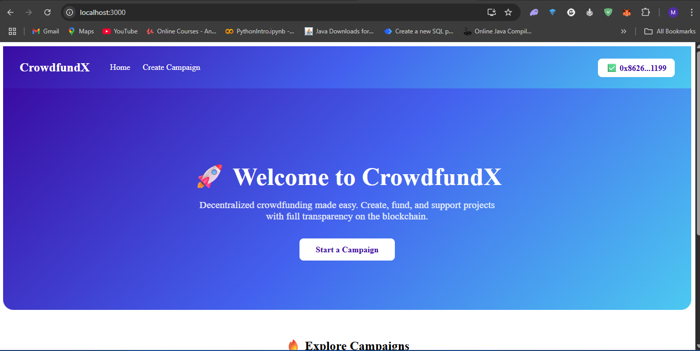
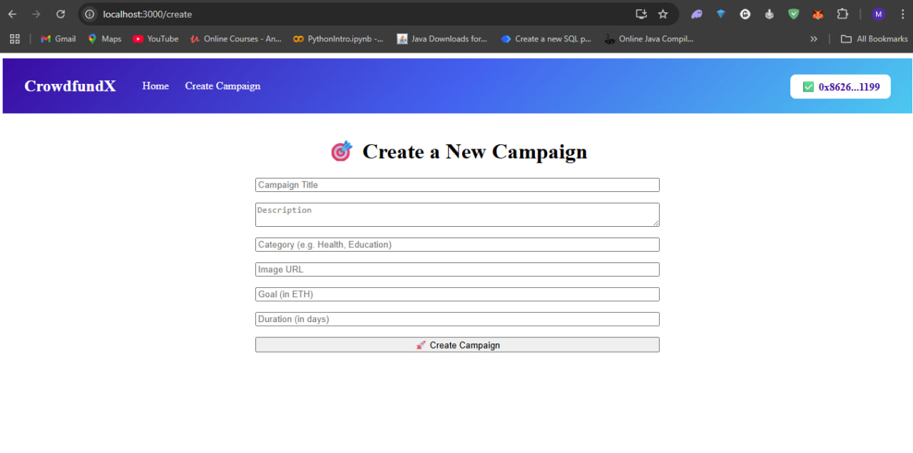
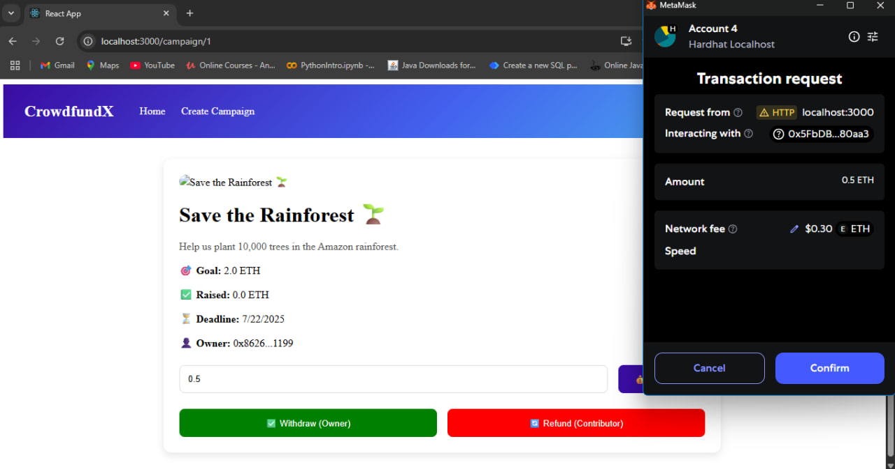

# 🌟 Decentralized Crowdfunding Platform

A fully on-chain Web3 crowdfunding DApp where anyone can create campaigns, contribute ETH, and withdraw or refund funds based on campaign success.  
Built with React, Ethers.js, Hardhat, and Solidity.  
Deployed locally on Hardhat for development.

---

## 🚀 Features

- Decentralized Campaigns  
  No centralized control—campaigns are stored directly on the blockchain.
- Create Campaigns  
  Launch campaigns with a title, description, category, image, funding goal, and deadline.
- Contribute ETH  
  Backers can easily contribute ETH using MetaMask.
- Progress Tracking  
  View dynamic progress bars for each campaign’s funding status.
- Withdraw & Refund
  - *Owners*: Withdraw funds if the goal is reached after the deadline.
  - *Contributors*: Refund ETH if the campaign fails to meet its goal after the deadline.
- Responsive UI  
  Clean, modern, and responsive React interface.
- Fully On-Chain  
  No centralized backend—data is stored on the blockchain via smart contracts.

---

## 🛠 Tech Stack

- Frontend: React, React Router  
- Styling: Custom CSS (minimal dependencies)  
- Blockchain: Solidity smart contracts  
- Dev Framework: Hardhat  
- Wallet Integration: MetaMask + Ethers.js  
- Local Blockchain: Hardhat Node  

---

## 📸 Screenshots

### 🏠 Home Page  

### 📝 Create Campaign  

### 📄 Campaign Details  

---

## 🏠 Home Page  
Displays all campaigns with real-time funding progress.

## 📄 Campaign Details  
View campaign details, contribute ETH, and (if eligible) withdraw or refund funds.

## 📝 Create Campaign  
A simple form to launch a new campaign stored on the blockchain.

---
