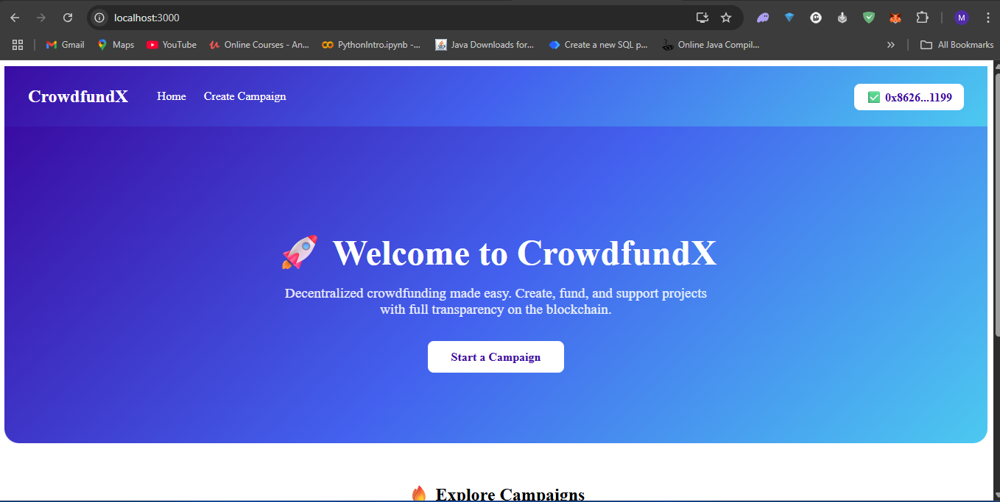

🌟 Decentralized Crowdfunding Platform
A fully on-chain Web3 crowdfunding DApp where anyone can create campaigns, contribute ETH, and withdraw or refund funds based on campaign success. Built with React, Ethers.js, Hardhat, and Solidity, deployed on a local Hardhat blockchain.

🚀 Features
✅ Decentralized Campaigns – No centralized control, campaigns are stored directly on the blockchain.
✅ Create Campaigns – Easily create campaigns with title, description, category, image, funding goal, and deadline.
✅ Contribute ETH – Backers can contribute ETH to campaigns directly from MetaMask.
✅ Progress Tracking – Each campaign shows funding progress with a dynamic progress bar.
✅ Withdraw & Refund

Owner can withdraw funds if the goal is reached after the deadline.

Contributors can claim a refund if the campaign fails to meet its goal after the deadline.
✅ Responsive UI – Modern and clean React interface.
✅ Fully On-Chain – No centralized backend or database, all data stored in the smart contract.

🛠 Tech Stack
Frontend: React + React Router

Styling: Custom CSS (minimal dependencies)

Blockchain: Solidity smart contract

Blockchain Framework: Hardhat

Wallet Integration: MetaMask + Ethers.js

Local Blockchain: Hardhat Node

📸 Screenshots
### 🏠 Home Page  

### 📝 Create Campaign  

### 📄 Campaign Details  

  
🏠 Home Page
Displays all campaigns with progress bars showing funding status.

📄 Campaign Details
View campaign details, contribute ETH, and (if eligible) withdraw or refund funds.

📝 Create Campaign
A simple form to create a new campaign stored directly on the blockchain.

⚡ Getting Started
1️⃣ Clone the Repository
bash
Copy
Edit
git clone https://github.com/your-username/your-repo-name.git
cd your-repo-name
2️⃣ Install Dependencies
Frontend:

bash
Copy
Edit
cd frontend
npm install
Smart Contract:

bash
Copy
Edit
cd smart-contract
npm install
3️⃣ Start Local Blockchain
Open a new terminal:

bash
Copy
Edit
cd smart-contract
npx hardhat node
4️⃣ Deploy Smart Contract
In another terminal:

bash
Copy
Edit
cd smart-contract
npx hardhat run scripts/deploy.js --network localhost
Copy the contract address printed in the terminal and update it in frontend/src/constants.js.

5️⃣ Run the Frontend
bash
Copy
Edit
cd frontend
npm start
6️⃣ Connect MetaMask
Add a Localhost 8545 network in MetaMask

Import one of the test accounts from Hardhat (private keys shown when running npx hardhat node)

Connect wallet and start interacting with the DApp

📜 Smart Contract Overview
createCampaign() → Create a new campaign

contribute() → Contribute ETH to a campaign

withdraw() → Campaign owner withdraws funds if successful

refund() → Contributors refund if campaign fails

getCampaign() → Get campaign details

campaignCount() → Total campaigns

🌐 How It Works
Anyone can create a campaign with a goal & deadline

Users can contribute ETH before the deadline

After the deadline:

If goal is met, owner withdraws

If goal not met, contributors refund

🔮 Future Improvements
✅ Deploy to a public testnet (Goerli, Sepolia)

✅ Use IPFS for storing images & metadata

✅ Add user profiles & history of contributions

✅ Add notifications for contributors

🤝 Contributing
Pull requests are welcome! Feel free to open issues for feature requests, bug reports, or improvements.

